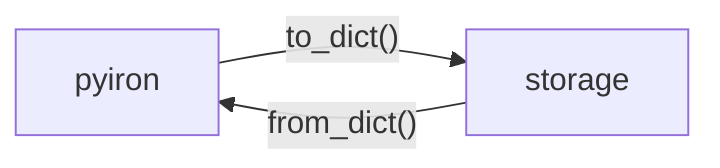

# Specs for modules constituting next gen workflow manager

In this repo, you find the main components of the next generation workflow manager and their specs. Feel free to open PR's to propose changes

## What's spec?

Well written specs should:

- define terms used in the module
- specify technical requirements
- guarantee functionalities

Basically: "I promise to do ABC if you provide me XYZ"

## What do we need it for?

The single biggest advantage of specifying specs is it allows us to divide a huge chunk of code like pyiron into smaller parts. Taking an example of the current storage interface:

Now if you want to make changes in `storage`, you don't need to know anything about pyiron - you just need to know that a `dict` must be saved and loaded, along with other conditions stated in the specs.

Therefore, it is crucial to state the requirements **explicitly**; it's not a place to merely state conceptual ideas in words.

## Examples

### Bad

"The storage interface takes the data from pyiron and stores it in the working directory"

NB: It doesn't mean that this phrase must not be written. It just needs more clarification.
### Good

"The storage interfaces stores the data via `save()`, which takes the arguments `data: dict` and `path: str`"

## Overview 
* Abstract Definition
  * [Concepts](concepts.md)
* User Interface
  * [Function](function.md)
  * [Dataclasses](dataclasses.md)
* Backend
  * [Storage](storage.md)
  * [Database](database.md)
  * [Executor](executor.md)
