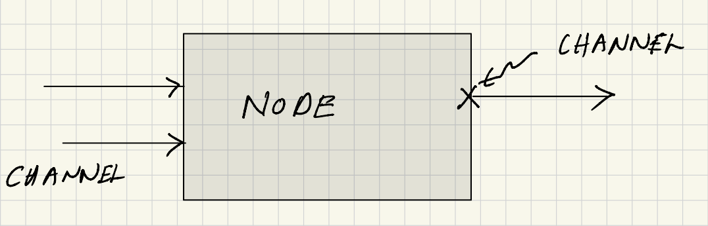
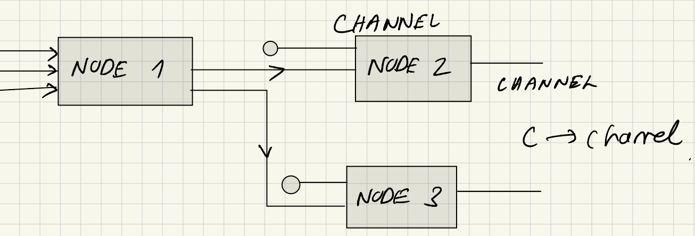
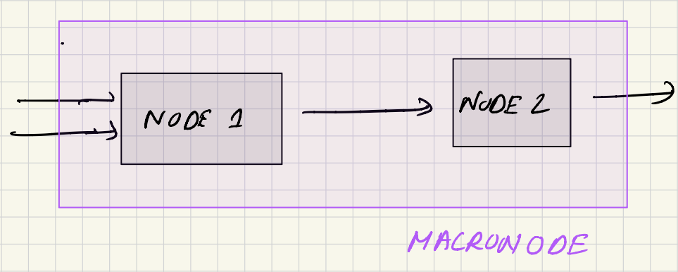

# Big Picture - Language 
High level definition of a node based workflow
- What is required for a complete representation? 

## Nodes

- defined by a pure Python function
- a node has one or more input channels and / or one or more output channels 

## Channel

- supports optional type hints (strongly encouraged)
- knows who it is connected to (technical implementation)
- knows who it is parent node is (technical implementation)

### Encouraged Channel Type Hints
- primitive Python data types 
    - None
    - int
    - str
    - float
    - list (of primitive Python data types)
    - dict (of primitive Python data types)
- Converter to JSONable data types for:
    - np.array
    - dataclasses (with fields of such dataclasses or primitive Python data types)

## Edges
- directed edges - difference between input and output
- $[((n_i, p_i) -> (n_j, p_j)), ...]$
- an edge connects channels between nodes 

## Workflow 
- graph network of nodes and edges 
- instance 

## Marco Node 

- function that defines a workflow 
- class definition 

## Challenges 
- Cyclic Workflows - dynamic instantiation of nodes
- Pass a node as input 
- pass in a node into a workflow - pass in LAMMPS in Murnaghan
- a modified macro should result in a different hash 
- Convert dataclass to many channels - the other direction of data to dataclass already works
- high throughput studies - currently in pyiron_base represented by the database and pyiron table 
- decide which nodes should be hashed 

# Features for Execution
- replace one node by another in a given workflow / macro 
- composability 
- FAIR 
- settings as optional input to the nodes def(a, b, c, settings)
- setting is a primitive dataclass - this could ideally be even standardized between different workflow frameworks 

## Hashable Storage 
- requires JSONable data on the edges 

## Execution 

# Specs 
[see Github](https://github.com/pyiron/specs) - add pseudo code for each interface 

# Strategy 

# Tasks 
What do we need to develop in the next three to six months. 

